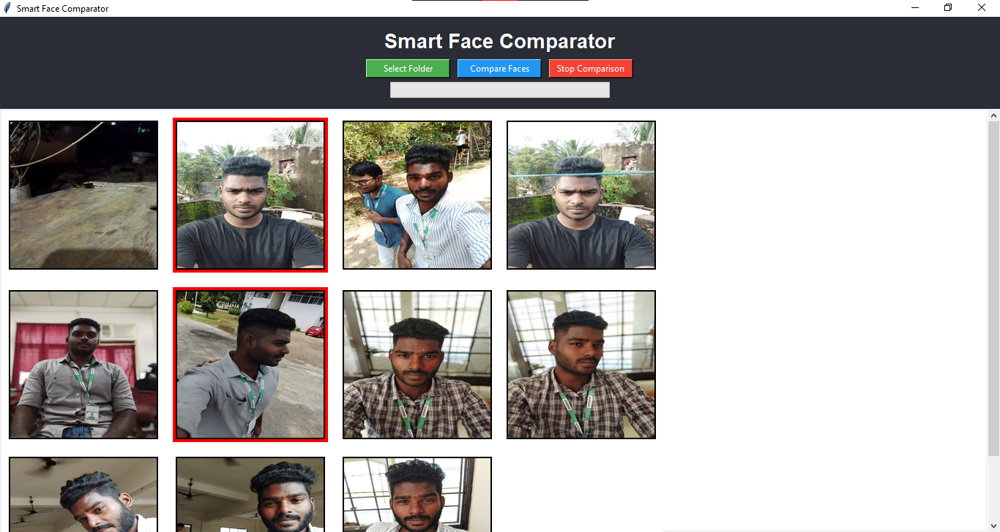
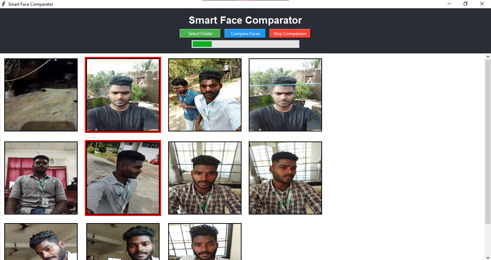
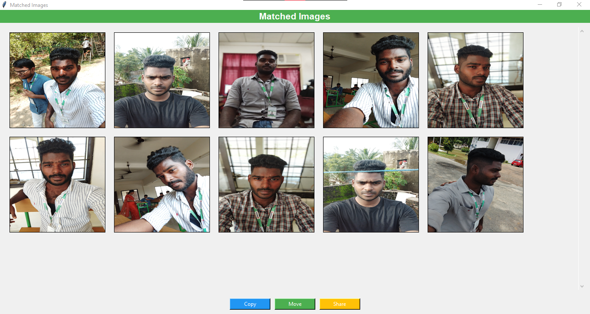

### Smart Face Comparator and Retriever 🎯
- A Tkinter-based desktop application that helps you efficiently compare facial features across images in a selected folder, retrieve matching images, and manage them (Copy, Move, Share).
This is my Final Semester Project.

### 🚀 Features
- ✅ Select a folder and display images as a gallery.

- ✅ Select multiple base images for comparison.

- ✅ Face encoding with caching for optimized performance.

- ✅ Progressive comparison using optimized matching logic.

- ✅ Visual progress bar and option to stop comparison.

- ✅ Retrieve and display all matched images in a new window.

- ✅ Copy, Move, or Share matched images.

- ✅ Simple, clean, and user-friendly interface built with Tkinter.

### 📸 Technologies Used
- Python 3
- Tkinter (GUI)
- Pillow (PIL) - Image processing
- face_recognition - Facial feature encoding & comparison
- Threading - For background comparison without freezing the UI
- Shutil - File management (Copy/Move)

### 🖼️ Screenshots

### Gallery View

### Comparison Progress	

### Matched Images

### 🛠 How to Run
### Clone the repository:

- git clone https://github.com/Kumaresan277/Smart-Face-Comparator-and-Retriever.git
- cd smart-face-comparator

## Install dependencies:

- pip install face_recognition pillow
- Run the application:
- python SmartFaceComp.py

### 📌 Future Improvements
- Implement Share functionality.
- Add multi-threaded or parallel encoding for faster processing.
- Implement image similarity metrics.
- Cross-platform packaging (.exe, .app).

### 👨‍🎓 Author
- Kumaresan D
- Final Semester Project | LinkedIn

